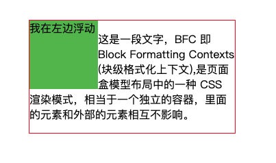
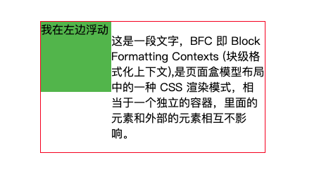
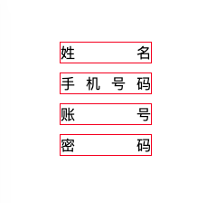

## 前端面试题库
## 1、介绍下 BFC 及其应用
```
- BFC 即 Block Formatting Contexts (块级格式化上下文),是页面盒模型布局中的一种 CSS 渲染模式，相当于一个独立的容器，里面的元素和外部的元素相互不影响。
- 创建 BFC 的方式有：
html 根元素
float 浮动
position (absolute、fixed)
overflow 除了 visible 以外的值 (hidden、auto、scroll)
display 为 inline-block、table-cells、flex
```
#### BFC 特性
1）同一个 BFC 下外边距会发生折叠。

如下例子两个盒子之间距离只有100px，这不是 CSS 的 bug，我们可以理解为一种规范，如果想要避免外边距的重叠，可以将其放在不同的 BFC 容器中。
```html
<head>
    <style>
        div{
            width: 100px;
            height: 100px;
            margin: 100px;
            border: 1px solid red;
        }
    </style>
</head>
<body>
    <div></div>
    <div></div>
</body>
```
即可改成这样
```html
<head>
    <style>
        p{
            width: 100px;
            height: 100px;
            margin: 100px;
            border: 1px solid red;
        }
        div{
            overflow: hidden;
        }
    </style>
</head>
<body>
    <div>
        <p></p>
    </div>
    <div>
        <p></p>
    </div>
</body>
```
2）BFC 可以包含浮动的元素（清除浮动）
```html
<head>
    <style>
        p{
            width: 100px;
            height: 100px;
            background: black;
            float: left;
        }
        div{
            width: 100%;
            border: 1px solid red;
            /* 清除浮动 div可包含浮动的元素*/
            overflow: hidden;
        }
    </style>
</head>
<body>
    <div>
        <p></p>
    </div>
</body>
```
3）BFC 可以阻止元素被浮动元素覆盖

下面是一个文字环绕效果
```html
<head>
    <style>
        div{
            width: 100px;
            height: 100px;
            background: #4CAF50;
            float: left;
        }
        section{
            width: 300px;
            border: 1px solid red;
            margin: 100px;
        }
    </style>
</head>
<body>
    <section>
        <div>我在左边浮动</div>
        <p>这是一段文字，BFC 即 Block Formatting Contexts (块级格式化上下文),是页面盒模型布局中的一种 CSS 渲染模式，相当于一个独立的容器，里面的元素和外部的元素相互不影响。</p>
    </section>
</body>
```


给p元素添加overflow: hidden
```html
p{
    overflow: hidden;
}
```


这个方法可以用来实现两列自适应布局,左边宽度固定，右边自适应宽度

## 2、判断数组的方法，请分别介绍它们之间的区别和优劣
```js
Object.prototype.toString.call()、instanceof、Array.isArray()以及typeof
```
1）Object.prototype.toString.call()

每一个继承 Object 的对象都有 toString 方法，如果 toString 方法没有重写的话，会返回 [object type]，其中 type 为对象的类型。但当除了 Object 类型的对象外，其他类型直接使用 toString 方法时，会直接返回都是内容的字符串，所以我们需要使用call或者apply方法来改变toString方法的执行上下文。
```js
const an = ['Hello','World'];
an.toString(); // "Hello,World"
Object.prototype.toString.call(an); // "[object Array]"
```
这种方法对于所有基本的数据类型都能进行判断，即使是 null 和 undefined 。
但是无法区分自定义对象类型，自定义类型可以采用instanceof区分
```js
console.log(Object.prototype.toString.call("this"));//[object String]
console.log(Object.prototype.toString.call(12));//[object Number]
console.log(Object.prototype.toString.call(true));//[object Boolean]
console.log(Object.prototype.toString.call(undefined));//[object Undefined]
console.log(Object.prototype.toString.call(null));//[object Null]
console.log(Object.prototype.toString.call({name: "this"}));//[object Object]
console.log(Object.prototype.toString.call(function(){}));//[object Function]
console.log(Object.prototype.toString.call([]));//[object Array]
console.log(Object.prototype.toString.call(new Date));//[object Date]
console.log(Object.prototype.toString.call(/\d/));//[object RegExp]
function Person(){};
console.log(Object.prototype.toString.call(new Person));//[object Object]
```
Object.prototype.toString.call() 常用于判断浏览器内置对象。

2）instanceof

instanceof 的内部机制是通过判断对象的原型链中是不是能找到类型的 prototype。

使用 instanceof判断一个对象是否为数组，instanceof 会判断这个对象的原型链上是否会找到对应的 Array 的原型，找到返回 true，否则返回 false。

但 instanceof 只能用来判断对象类型，原始类型不可以。并且所有对象类型 instanceof Object 都是 true。
```js
instanceof Array; // true
instanceof Object; // true
'a' instanceof String; //false
```
3）Array.isArray()

- 功能：用来判断对象是否为数组
- instanceof 与 isArray

当检测Array实例时，Array.isArray 优于 instanceof ，因为 Array.isArray 可以检测出 iframes
```js
var iframe = document.createElement('iframe');
document.body.appendChild(iframe);
xArray = window.frames[window.frames.length-1].Array;
var arr = new xArray(1,2,3); // [1,2,3]

// Correctly checking for Array
Array.isArray(arr);  // true
Object.prototype.toString.call(arr); // true
// Considered harmful, because doesn't work though iframes
arr instanceof Array; // false
```
- Array.isArray() 与 Object.prototype.toString.call()<br />
Array.isArray()是ES5新增的方法，当不存在 Array.isArray() ，可以用 Object.prototype.toString.call() 实现。
```js
if (!Array.isArray) {
    Array.isArray = function(arg) {
        return Object.prototype.toString.call(arg) === '[object Array]';
    };
}
```
4）typeof
```js
typeof 只能检测基本数据类型，包括boolean、undefined、string、number、symbol，而null、Array、Object ,使用typeof检测出来都是Object，无法检测具体是哪种引用类型。
```

## 3、怎么让一个div水平垂直居中
```html
<div class="parent">
    <div class="child"></div>
</div>
```
1）使用position + transform，不定宽高时
```css
.parent{
    position: relative;
}
.child{
    position: absolute;
    left: 50%;
    top: 50%;
    transform: translate(-50%,-50%);
}
```

2）使用position + transform，有宽高时
```css
.parent{
    position: relative;
}
.child{
    width: 100px;
    height: 100px;
    position: absolute;
    left: 50%;
    top: 50%;
    margin-left: -50px;
    margin-top: -50px;
}
```
3）使用flex
```css
.parent{
    display: flex;
    align-items: center;
    justify-content: center;
}
```
或者
```css
.parent{
    display: flex;
    align-items: center;
}
.child{
    margin: 0 auto;
}
```
或者
```css
.parent{
    display: flex;
}
.child{
    margin: auto;
}
```

4）使用position
```css
.parent{
    position: relative;
}
.child{
    position: absolute;
    left: 0;
    top: 0;
    right: 0;
    bottom: 0;
    margin: auto;
}
```
5）使用grid
```css
.parent{
    display: grid;
}
.child{
    justify-self: center;
    align-self: center;
}
```
6）使用table
```css
.parent{
    display: table;
}
.child{
    display: table-cell;
    vertical-align: middle;
    text-align: center;
}
```
或者
```css
.parent {
    display: table-cell;
    text-align: center;
    vertical-align: middle;
}
.child {
    display: inline-block;
}
```

7）使用伪类
```css
.parent{
    font-size: 0;
    text-align: center;
}
.parent::before {
    content: "";
    display: inline-block;
    width: 0;
    height: 100%;
    vertical-align: middle;
}
.child{
    display: inline-block;
    vertical-align: middle;
}
```

## 4、下面的代码打印什么内容，为什么？
```js
var b = 10;
(function b(){
    b = 20;
    console.log(b); 
})();
```
正常模式下：
```js
var b = 10;
(function b() {
   // 内部作用域，会先去查找是有已有变量b的声明，有就直接赋值20，确实有了呀。发现了具名函数 function b(){}，拿此b做赋值；
   // IIFE的函数无法进行赋值（内部机制，类似const定义的常量），所以无效。
  // （这里说的“内部机制”，想搞清楚，需要去查阅一些资料，弄明白IIFE在JS引擎的工作方式，堆栈存储IIFE的方式等）
    b = 20;
    console.log(b); // [Function b]
    console.log(window.b); // 10，不是20
})();
```
严格模式下会报错：
```js
var b = 10;
(function b() {
  'use strict'
  b = 20;
  console.log(b)
})() // "Uncaught TypeError: Assignment to constant variable."
```
有window：
```js
var b = 10;
(function b() {
    window.b = 20; 
    console.log(b); // [Function b]
    console.log(window.b); // 20是必然的
})();
```
有var：
```js
var b = 10;
(function b() {
    var b = 20; // IIFE内部变量
    console.log(b); // 20
   console.log(window.b); // 10 
})();
```
## 5、下面的代码打印什么内容，为什么？
```js
var a = 10;
(function () {
    console.log(a)
    a = 5
    console.log(window.a)
    var a = 20;
    console.log(a)
})()
```
先说结果

依次为：undefined，10，20
```js
var a = 10;
(function () {
    //函数里面重新定义了a，变量提升，预解析
    console.log(a);//undefined
    a = 5;
    console.log(window.a);//10，a是函数局部变量
    var a = 20;
    console.log(a);//当然20
})()
console.log(a);//10，相当于window.a
```
换成这样：
```js
var a = 10;
(function () {
    //函数里面没有重新定义
    console.log(a);//10
    a = 5;
    console.log(window.a);//5
    a = 20;
    console.log(a);//当然20
})()
console.log(a);//20，相当于window.a
```
换成这样：
```js
var a = 10;
function b() {
    //函数里面重新定义了a，变量提升，预解析
    console.log(a);//undefined
    a = 5;
    console.log(window.a);//10，a是函数局部变量
    var a = 20;
    console.log(a);//当然20
}
b();
console.log(a);//10，相当于window.a
```
## 6、简单介绍下重绘和回流（Repaint & Reflow），以及如何进行优化

### 先来看下浏览器的渲染过程


从上面这个图上，我们可以看到，浏览器渲染过程如下：
```
1、解析HTML，生成DOM树，解析CSS，生成CSSOM树
2、将DOM树和CSSOM树结合，生成渲染树(Render Tree)
3、Layout(回流):根据生成的渲染树，进行回流(Layout)，得到节点的几何信息（位置，大小）
4、Painting(重绘):根据渲染树以及回流得到的几何信息，得到节点的绝对像素
5、Display:将像素发送给GPU，展示在页面上。（这一步其实还有很多内容，比如会在GPU将多个合成层合并为同一个层，并展示在页面中，而css3硬件加速的原理则是新建合成层）
```
渲染过程看起来很简单，让我们来具体了解下每一步具体做了什么。

### 生成渲染树


为了构建渲染树，浏览器主要完成了以下工作：

1. 从DOM树的根节点开始遍历每个可见节点。
2. 对于每个可见的节点，找到CSSOM树中对应的规则，并应用它们。
3. 根据每个可见节点以及其对应的样式，组合生成渲染树。

第一步中，既然说到了要遍历可见的节点，那么我们得先知道，什么节点是不可见的。不可见的节点包括：

- 一些不会渲染输出的节点，比如script、meta、link等。
- 一些通过css进行隐藏的节点。比如display:none。注意，利用visibility和opacity隐藏的节点，还是会显示在渲染树上的。只有display:none的节点才不会显示在渲染树上。

####  注意：渲染树只包含可见的节点

### 回流
前面我们通过构造渲染树，我们将可见DOM节点以及它对应的样式结合起来，可是我们还需要计算它们在设备视口(viewport)内的确切位置和大小，这个计算的阶段就是回流。

为了弄清每个对象在网站上的确切大小和位置，浏览器从渲染树的根节点开始遍历，我们可以以下面这个实例来表示：
```html
<!DOCTYPE html>
<html>
    <head>
        <meta name="viewport" content="width=device-width,initial-scale=1">
        <title>Critial Path: Hello world!</title>
    </head>
    <body>
        <div style="width: 50%">
        <div style="width: 50%">Hello world!</div>
        </div>
    </body>
</html>
```
我们可以看到，第一个div将节点的显示尺寸设置为视口宽度的50%，第二个div将其尺寸设置为父节点的50%。而在回流这个阶段，我们就需要根据视口具体的宽度，将其转为实际的像素值。

### 重绘

最终，我们通过构造渲染树和回流阶段，我们知道了哪些节点是可见的，以及可见节点的样式和具体的几何信息(位置、大小)，那么我们就可以将渲染树的每个节点都转换为屏幕上的实际像素，这个阶段就叫做重绘节点。

既然知道了浏览器的渲染过程后，我们就来探讨下，何时会发生回流重绘。

### 何时发生回流重绘

我们前面知道了，回流这一阶段主要是计算节点的位置和几何信息，那么当页面布局和几何信息发生变化的时候，就需要回流。比如以下情况：

- 添加或删除可见的DOM元素
- 元素的位置发生变化
- 元素的尺寸发生变化（包括外边距、内边框、边框大小、高度和宽度等）
- 内容发生变化，比如文本变化或图片被另一个不同尺寸的图片所替代。
- 页面一开始渲染的时候（这肯定避免不了）
- 浏览器的窗口尺寸变化（因为回流是根据视口的大小来计算元素的位置和大小的）

#### 注意：回流一定会触发重绘，而重绘不一定会回流

根据改变的范围和程度，渲染树中或大或小的部分需要重新计算，有些改变会触发整个页面的重排，比如，滚动条出现的时候或者修改了根节点。

### 浏览器的优化机制

现代的浏览器都是很聪明的，由于每次重绘都会造成额外的计算消耗，因此大多数浏览器都会通过队列化修改并批量执行来优化重绘过程。浏览器会将修改操作放入到队列里，直到过了一段时间或者操作达到了一个阈值，才清空队列。但是！当你获取布局信息的操作的时候，会强制队列刷新，比如当你访问以下属性或者使用以下方法：

- offsetTop、offsetLeft、offsetWidth、offsetHeight
- scrollTop、scrollLeft、scrollWidth、scrollHeight
- clientTop、clientLeft、clientWidth、clientHeight
- getComputedStyle()
- getBoundingClientRect
- 具体可以访问这个网站：https://gist.github.com/paulirish/5d52fb081b3570c81e3a

以上属性和方法都需要返回最新的布局信息，因此浏览器不得不清空队列，触发回流重绘来返回正确的值。因此，我们在修改样式的时候，最好避免使用上面列出的属性，他们都会刷新渲染队列。如果要使用它们，最好将值缓存起来。

### 减少回流和重绘

好了，到了我们今天的重头戏，前面说了这么多背景和理论知识，接下来让我们谈谈如何减少回流和重绘。

### 最小化重绘和重排

由于重绘和重排可能代价比较昂贵，因此最好就是可以减少它的发生次数。为了减少发生次数，我们可以合并多次对DOM和样式的修改，然后一次处理掉。考虑这个例子

```js
const el = document.getElementById('test');
el.style.padding = '5px';
el.style.borderLeft = '1px';
el.style.borderRight = '2px';
```
例子中，有三个样式属性被修改了，每一个都会影响元素的几何结构，引起回流。当然，大部分现代浏览器都对其做了优化，因此，只会触发一次重排。但是如果在旧版的浏览器或者在上面代码执行的时候，有其他代码访问了布局信息(上文中的会触发回流的布局信息)，那么就会导致三次重排。

因此，我们可以合并所有的改变然后依次处理，比如我们可以采取以下的方式：
- 使用cssText
    ```js
    const el = document.getElementById('test');
    el.style.cssText += 'border-left: 1px; border-right: 2px; padding: 5px;';
    ```
- 修改CSS的class
    ```js
    const el = document.getElementById('test');
    el.className += ' active';
    ```
具体参考：https://muyiy.cn/question/browser/22.html

## 7、文字两端对齐
```html
<div>姓名</div>
<div>手机号码</div>
<div>账号</div>
<div>密码</div>
```
```css
div {
    margin: 10px 0; 
    width: 100px;
    border: 1px solid red;
    text-align: justify;
    text-align-last: justify;
}
```


## 8、['1', '2', '3'].map(parseInt)的结果是什么？
```
先说结果：
['1', NaN, NaN]
为什么不是['1', '2', '3']呢，下面开始分析
```
- map() 方法返回一个新数组，数组中的元素为原始数组元素调用函数处理后的值。

- map() 方法按照原始数组元素顺序依次处理元素。

map(parseInt)其实是：
```js
map(function(item, index){
    return parseInt(item, index);
})
```
即依次运行的是：
```js
parseInt('1', 0);
parseInt('2', 1);
parseInt('3', 2);
```
### parseInt的用法

- parseInt(string, radix) 函数可解析一个字符串，并返回一个整数。
- 当参数 radix 的值为 0，或没有设置该参数时，parseInt() 会根据 string 来判断数字的基数。
- radix 可选。表示要解析的数字的基数。该值介于 2 ~ 36 之间。

所以：
parseInt('1', 0);//'1'
parseInt('2', 1);//NaN
parseInt('3', 2);//NaN，由于2进制中没有3

## 9、写出如下代码的打印结果（京东）
```js
function changeObjProperty(o) {
    o.siteUrl = "http://www.baidu.com";
    o = new Object();
    o.siteUrl = "http://www.google.com";
} 
let webSite = new Object();
changeObjProperty(webSite);
console.log(webSite.siteUrl);
```
此题咋看小问题，其实暗藏玄机。
先说答案：
```
console.log(webSite.siteUrl);//"http://www.baidu.com"
```
复盘如下：

```js
function changeObjProperty(o) {
    //o是形参，对象的引用，依旧指向原地址，相当于 var o = webSite;赋值改变对象的属性
    o.siteUrl = "http://www.baidu.com";
    //变量o指向新的地址 以后的变动和旧地址无关，题目打印的是外部webSite.siteUrl
    o = new Object();
    o.siteUrl = "http://www.google.com";
}
```

将题目改成如下：
```js
function changeObjProperty(o) {
    o.siteUrl = "http://www.baidu.com";
    o = new Object();
    o.siteUrl = "http://www.google.com";
    return o;
} 
let webSite = new Object();
changeObjProperty(webSite);
console.log(webSite.siteUrl);
let newSite = changeObjProperty(webSite);
console.log(newSite.siteUrl);
```
此时打印结果如下：
```j
console.log(webSite.siteUrl);//"http://www.baidu.com"
console.log(newSite.siteUrl);//"http://www.google.com"
```