**jenkins工作流的构建--实现自动化构建及邮件提醒功能**
----------
## 背景
*  现阶段：开发 -> git push -> git pull -> 比较代码 -> 编译 -> 部署到全网 -> 重启服务器
*  接入jenkins之后：开发 -> git push -> jenkins自动构建部署

## jenkins是什么
```
jenkins是一个开源软件项目，是基于Java开发的一种持续集成工具，用于监控持续重复的工作，旨在提供一个开放易用的软件平台，使软件的持续集成变成可能。
```
## 构建流程

1. 从Jenkins官网下载最新war文件。(https://jenkins.io/download/)
2. 安装jdk(https://www.oracle.com/technetwork/java/javase/downloads/jdk11-downloads-5066655.html)
3. 运行java -jar jenkins.war即可
4. 安装插件（github，Generic Webhook Trigger）
5. nodejs配置：system settings -> 全局工具配置
6. create new job
7. 使用webhooks建立连接
8. git push --> 触发webhooks --> jenkins开始工作
9. 构建结果 -> 通过邮件通知结果

## 详细流程

### 初始化jenkins包

下好war包之后，运行java -jar jenkins.war --httpPort=8383(指定端口8383)
打开本地http://localhost:8383 按照提示依次可看到

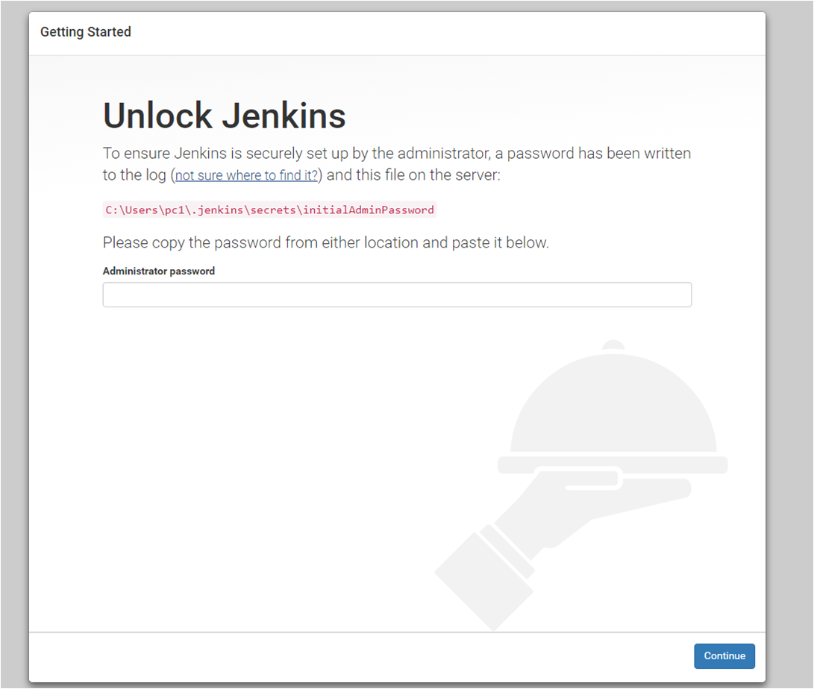
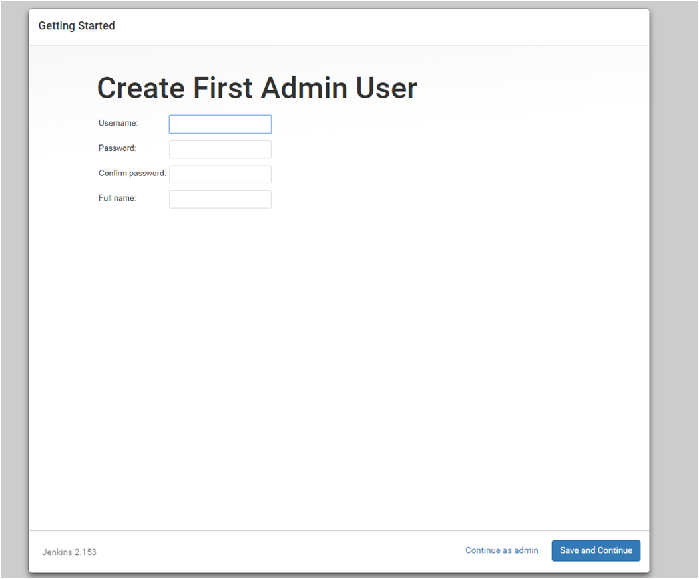
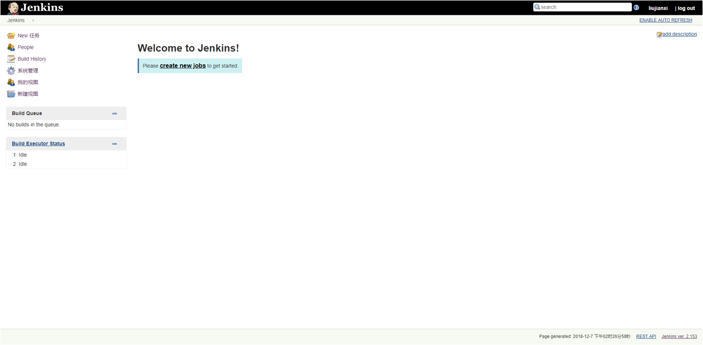

### 安装插件（github，Generic Webhook Trigger）
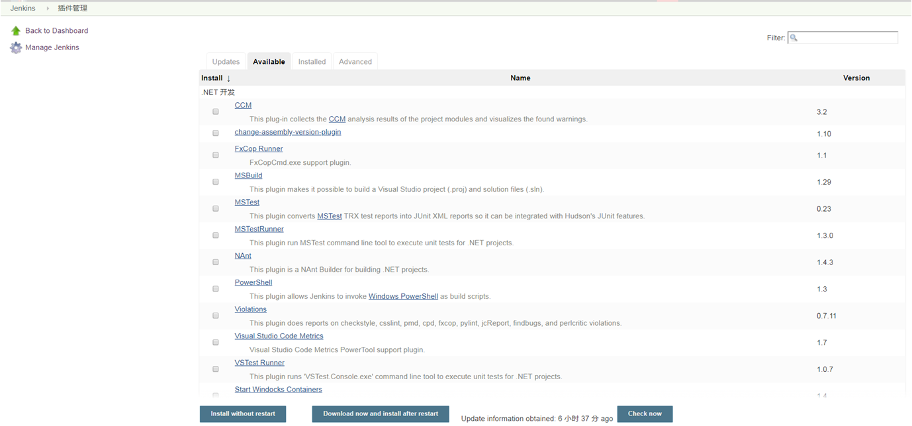

### NodeJs配置：system settings -> 全局工具配置
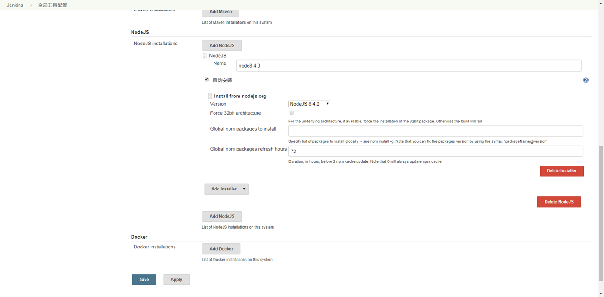

### create new job: 
创建一个自由风格的软件项目
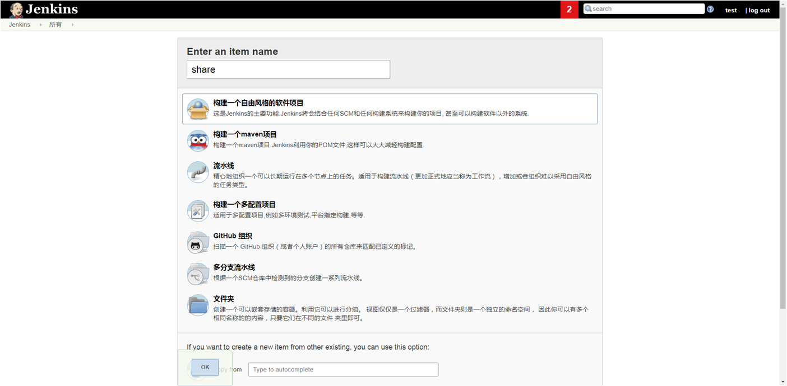

在Source Code Management中填入相关的git源码地址
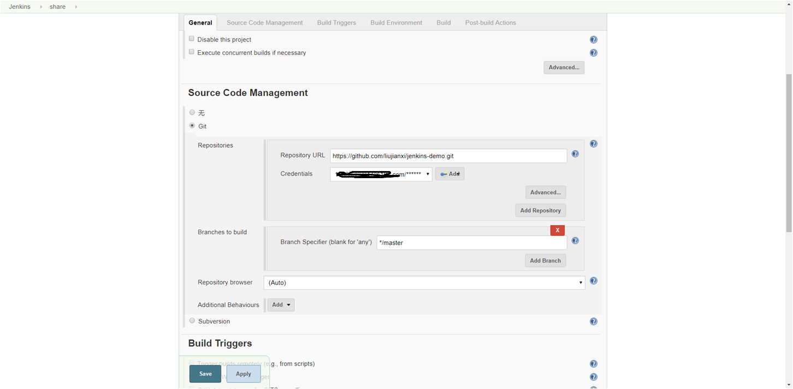

在Build Triggers 中选择


在Build Environment及在build中选择NodeJs版本和写入需执行的shell脚本
此次的shell脚本如下：
```shell
echo 'check node --version'
node --version
cd mock-demo
npm install -g cnpm --registry=https://registry.npm.taobao.org
npm install
npm install -g mocha
echo 'test-------start'
npm run test
echo 'npm--------build'
npm run build
```
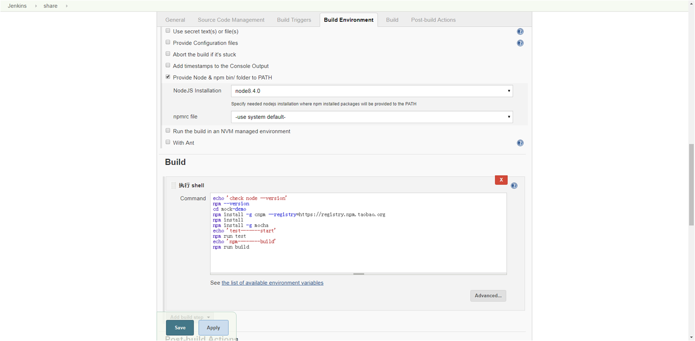

### 使用webhooks建立连接
```
工作原理：
在远端仓库上配置一个Jenkins服务器的接口地址，当本地向远端仓库发起push时，远端仓库会向配置的Jenkins服务器的接口地址发起一个带参数的请求，jenkins收到后开始工作。
```
在github中设置webhooks
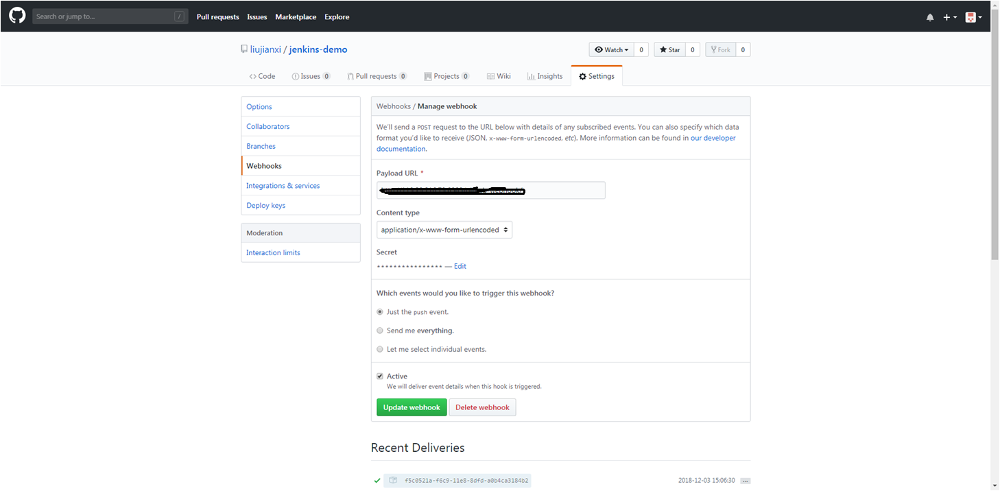
图中Secret是jenkins的密码，有个选项是想什么时候触发这个钩子，这里默认用push触发钩子\
点击提交完成配置。
其中Payload URL是在jenkins中可以获取的。当本地向远端仓库发起push请求时，会触发jenkins，然后jenkins开始工作。
在jenkins中设置github Hook URL：
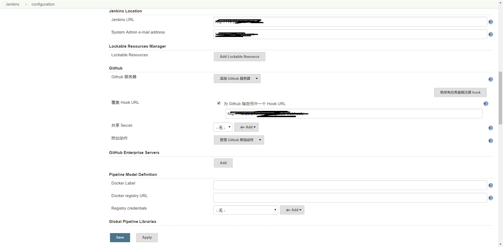

### git push --> 触发webhooks --> jenkins开始工作
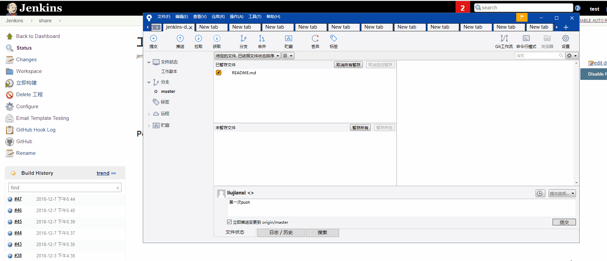

### 构建结果 --> 通过邮件通知结果
在Jenkins -> 系统设置 -> E-mail Notification 中设置\
在Test e-mail recipient出填写测试邮件地址，就可测试是否能收到邮件
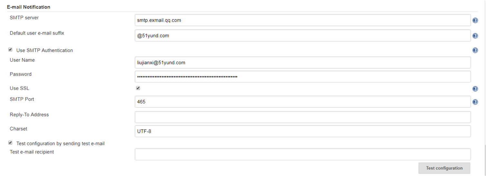

然后在jenkins项目中settings -> Post-build Actions设置\
在选择触发器时可选always或failure等触发邮件提醒
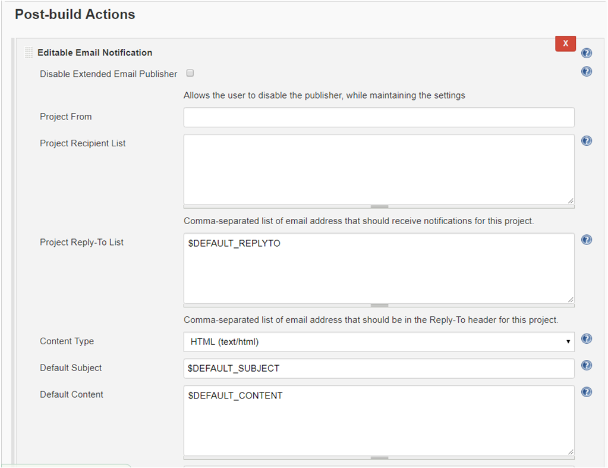
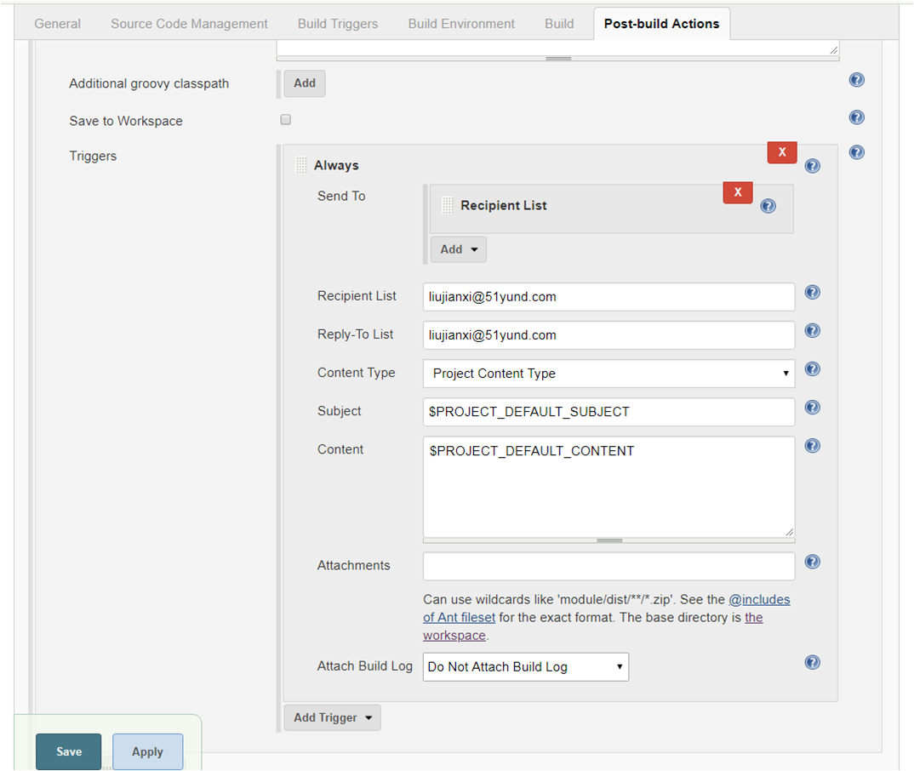

### 构建结果
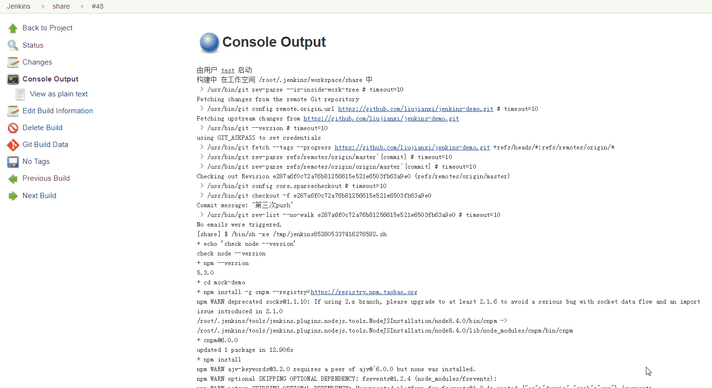

## 写在最后
```
jenkins的插件成千上万，功能十分强大，目前实现了自动构建以及邮件提醒功能。
本次使用的demo地址为：https://github.com/liujianxi/jenkins-demo
```