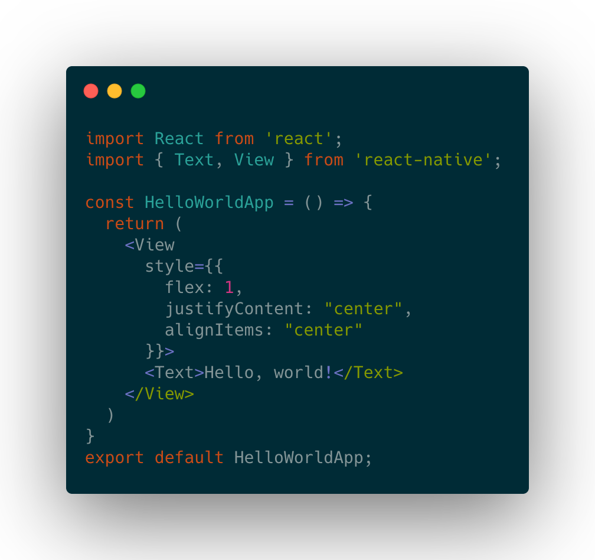
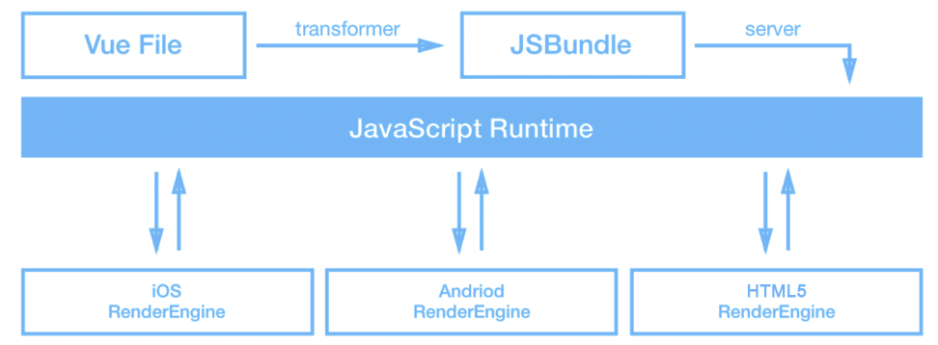
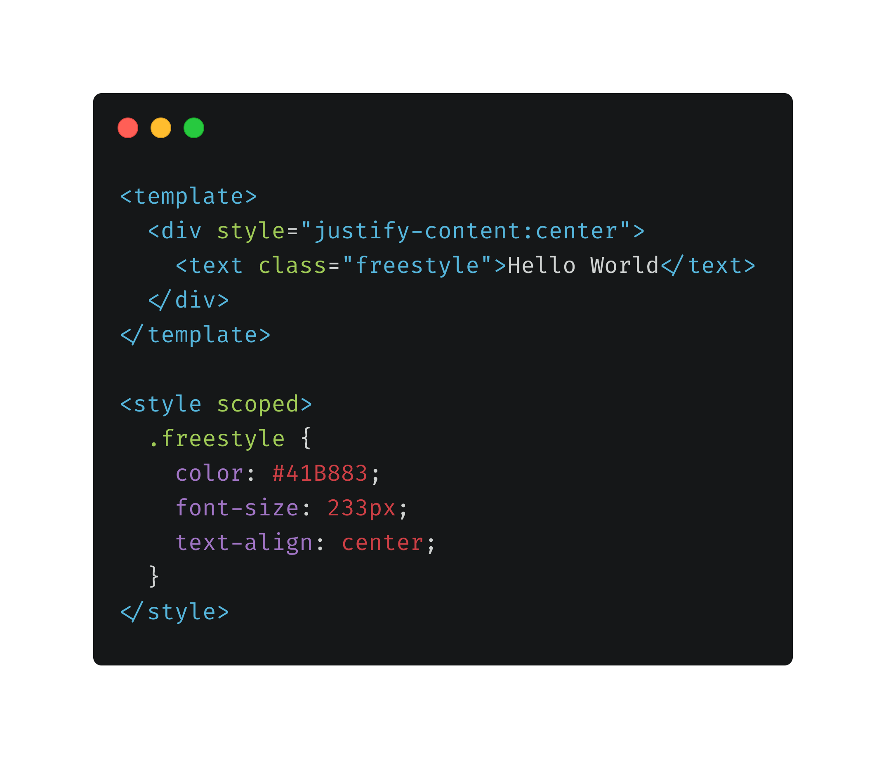
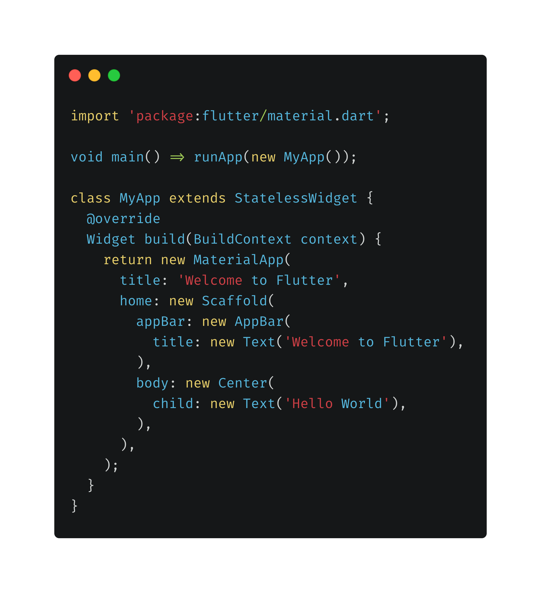
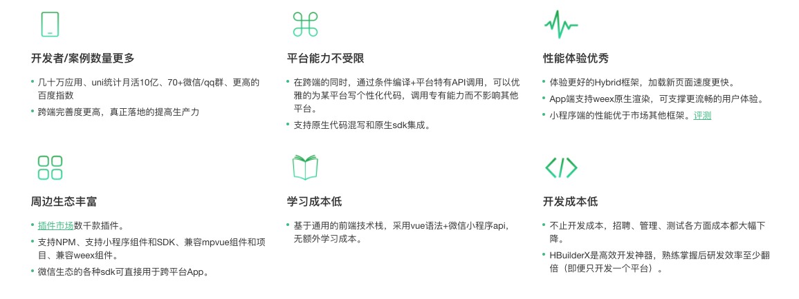
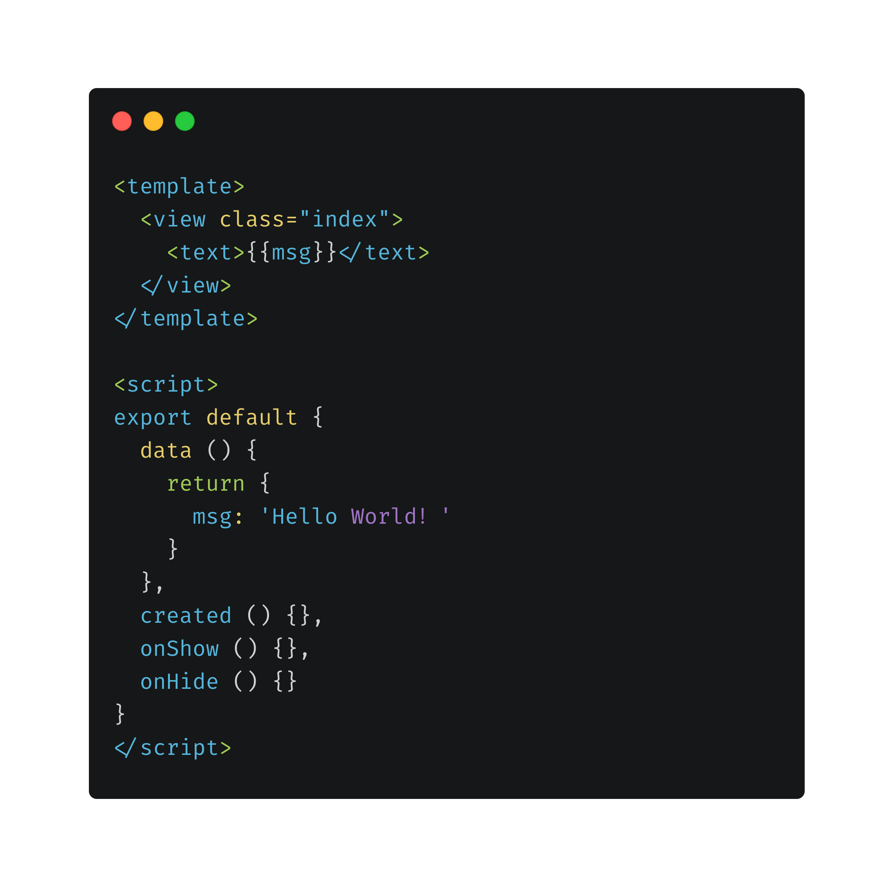

# 一次开发，多端运行，多端统一开发方案的介绍

## 为什么要跨平台技术开发

2017年起80%交易量来自于移动端，移动端取代PC端，成为了互联网行业最大的流量分发入口。智能化的到来，移动端的便捷是PC端不可比拟的。

根据数据显示移动端的操作系统中Android和iOS占据了96%以上。

我们知道开发Android用的是Java或Kotlin，开发iOS则是Objective-C或Swift。
虽然特定的开发环境对特定的操作系统拥有对资源更高效的调配效率，可防止发生性能问题。但缺点也很显而易见，开发人员需要使用不同的开发语言构建两个独立的应用程序，这需要付出更多的时间、金钱和精力。

为了解决上述缺点，也是为了抢占移动应用时代红利，跨平台技术应运而生。

## 跨平台开发的三个渲染方案

介绍具体的跨平台框架之前，先了解下跨平台开发的三个渲染方案

### （1）WebView渲染

- 原生内嵌WebView进行渲染，在功能和性能上有所妥协，例如PhoneGap(Cordova)、Ionic、小程序等。

### （2）原生渲染

- 上层拥抱W3C，通过中间层把前端框架翻译为原生控件，例如React Native+React、Weex+Vue的组合，这种方案多了一层转译层，性能上有损耗。随着原生系统的升级，在兼容性上也会有问题。

### （3）自建渲染

- 自建渲染框架，底层使用Skia等图形库进行渲染，例如Flutter。

接下来会对React Native、Weex，Flutter，uni-app，Taro等受欢迎的跨平台方案进行简单的介绍和对比。

## React Native

### RN的简介

React Native(简称RN)是Facebook于2015年4月开源的跨平台移动应用开发框架，它的slogon是：Learn once, write anywhere，支持的平台有iOS、Android、Windows、macOS等

RN使用Javascript语言来开发移动应用，但UI渲染、网络请求等均由原生端实现。具体来说，开发者编写的Javascript代码，通过中间层转化为原生控件后再执行，因此熟悉Web前端开发的技术人员只需很少的学习就可以进入移动应用开发领域，并可以在不牺牲用户体验的前提下提高开发效率。

### RN的工作原理

如图：

以往最早的Hybrid开发，主要依赖于WebView。但是WebView是一个很重的控件，很容易产生内存问题，而且复杂的UI在WebView上显示的性能不好。React Native技术抛开了WebView，利用JavaScriptCore来做桥接，将js调用转为native调用，只牺牲了小部分性能获取的跨平台开发，这是一大进步。

开发的过程中，大多数情况下并不需要了解React Native框架的具体细节，只需要专注JavaScript端的代码逻辑实现即可。

### Hello World 代码示例

总体来说，React Native使用JavaScript来编写应用程序，然后调用原生组件执行页面渲染操作，在提高了开发效率的同时又保留了原生的用户体验。

## weex

### weex的简介

Weex是由阿里研发的，是一个可以使用现代化的Web技术开发高性能原生应用的框架。支持的平台有iOS，Android，Web。Weex应用需要依赖前端框架来编写，但 Weex 并没有绑定、限制在特定的框架上。目前 Vue.js 和 Rax 是最广泛应用于 Weex 开发的前端框架，也是目前功能最全、最稳定的方案。

- 高性能：Weex 使用原生组件和原生模块，来最大化利用原生渲染的性能优势以及平台能力，所有的组件和模块都是可插拔、可扩展的。

- 跨平台：你可以使用同一份代码编译成不同目标文件分别在 Web、Android 和 iOS 平台上运行。原生的组件和模块在不同平台中有不同的实现，但是它们都提供了相同的接口。

- 贴近前端生态：Weex 拥抱已有的 Web 生态，你可以使用现代化的前端技术开发移动应用。 Weex 支持了最常用 CSS 样式以及最流行的前端框架，如 Vue 和 Rax，在未来或许还可以支持更多。

- 被大规模的使用：已经在许多超级App中大规模使用，如钉钉、淘宝，一共服务了数亿用户。Weex 还衍生出了各种工程化的产品和平台，以供工业生产使用。

### weex的工作原理

如图：

weex的整个工作流程图如上，weex框架中最核心的部分是JavaScript Runtime。具体来说就是，当需要执行渲染操作时，在iOS环境下选择基于JavaScriptCore的iOS系统提供的JSContext，在Android环境下使用基于JavaScriptCore的JavaScript引擎。

### Hello World 代码示例

总的来说，Weex使用native引擎渲染的是native组件，所以在性能上比传统的WebView方案要好很多。

## Flutter

### Flutter的简介

Flutter是Google的移动UI框架，使用Dart语言来开发，可以快速在iOS和Android上构建高质量的原生用户界面，相较于RN和Weex使用Javascript作为编程语言与使用平台自身引擎渲染界面不同，Flutter直接选择2D绘图引擎库skia来渲染界面，性能无限接近原生。在全世界，Flutter正在被越来越多的开发者和组织使用，如咸鱼，手机qq。

- 快速开发：毫秒级的热重载，修改后，您的应用界面会立即更新。使用丰富的、完全可定制的widget在几分钟内构建原生界面。

- 富有表现力和灵活的UI：使用Flutter内置美丽的Material Design和Cupertino（iOS风格）widget、丰富的motion API、平滑而自然的滑动效果和平台感知，为您的用户带来全新体验。

- 原生性能：Flutter包含了许多核心的widget，如滚动、导航、图标和字体等，这些都可以在iOS和Android上达到原生应用一样的性能。

### Flutter的工作原理

Flutter实现跨平台采用了更为彻底的方案。它既没有采用WebView也没有采用JavaScriptCore，而是自己实现了一套UI框架，然后更底层的渲染，这也就是性能无限接近原生的原因。

### Hello World 代码示例

总体来说，Flutter是目前最好的跨平台解决方案之一，它只用一套代码便可生成Android和iOS两种平台上的应用，很大程度上减少了App的开发和维护成本。同时，Dart语言强大的性能表现和丰富的特性，也使得跨平台开发变得更加便利。而不足的是，Flutter还处于初期测试阶段，许多功能还不是特别完善，而全新的Dart语言也增加了开发者的学习成本。Flutter要完全替代Android和iOS原生开发，还有比较长的路要走。

## React native、weex和Flutter的对比

|       | **React native**         | **weex**            | **Flutter** |
| -------------- | ----------|----------- | ----------------|
| 开源时间| 2015年4月| 2016年6月	| 2018年12月
| 支持平台| Android、iOS、Windows、macOS| Android/iOS/Web	| Android/iOS	
| 编程语言| React | React/Vue	| Dart
| star数量| 89.6k | 17.6k	| 99k
| 性能| 比WebView好，逊于flutter | 比WebView好，逊于flutter	| 无限接近于原生

## React native/weex/Flutter应用现状

数据来源：https://github.com/flexih/SnakeList

| 应用总数            | Swift | React Native | Flutter | Weex | ObjC | 时间 |
| --------------- | ----- | ------------ | ------- | ---- | ---- | ---- |
| 100 | 26 | 23 | 13 | 14 | 41 | 2020.03.08 |

1. ObjC指应用没有使用Swift/React Native/Flutter/Weex
2. 以上均指iPhone应用
3. 榜单来自 中国 App Store 免费榜 - iPhone - 2020年3月8日
4. 此列表仅用于统计

## uni-app

### uni-app的简介

uni-app是DCloud公司研发，一个使用 Vue.js 开发所有前端应用的框架，开发者编写一套代码，可发布到iOS、Android、H5、以及各种小程序（微信/支付宝/百度/头条/QQ/钉钉/淘宝）、快应用等多个平台。

### 为什么要选择uni-app

## Taro.js

### Taro简介

Taro是京东凹凸实验室出品，是一个开放式跨端跨框架解决方案，支持使用 React/Vue/Nerv 等框架来开发微信/京东/百度/支付宝/字节跳动/ QQ 小程序/H5 等应用。现如今市面上端的形态多种多样，Web、React Native、微信小程序等各种端大行其道，当业务要求同时在不同的端都要求有所表现的时候，针对不同的端去编写多套代码的成本显然非常高，这时候只编写一套代码就能够适配到多端的能力就显得极为需要。

### Hello World 代码示例

## 小程序/PWA/快应用

|       | **特点**         | **运行环境**            | **兼容性**     |  **开发语言**            |
| -------------- | ----------|----------- | ----------------|----------------|
| 小程序| 无需安装，用完即走	| 依赖于 APP，如 微信、支付宝	| 可跨平台 | 类Vue
| PWA| 无需安装，支持离线、通知、推送	| 依赖于 浏览器，由 Google 提出，现在 微软 、苹果 都在支持 | Android 支持较好，iOS 需要适配，国产浏览器支持较差| 无限制
| 快应用| 无需安装，与操作系统深度集成	| 依赖于 安卓手机系统，由国内九家手机厂商联合推出	| 不支持九家之外的系统 和 iOS 系统 | 类Vue

## 其他跨平台方案

还有很多其它的优秀跨平台方案，例如chameleon（滴滴），Hippy（腾讯），nativeScript，可按照自身技术栈或者兴趣，自行选择学习。

## 总结

跨平台的方案一次编码就可以在多个平台上高效运行，不需要为每个平台进行单独的编码，听起来就很酷，是开发app最喜欢的方案之一。尽管如此，问题也是有的，那就是在功能和性能上有所妥协，并不能完完全全代替Android/iOS开发。

