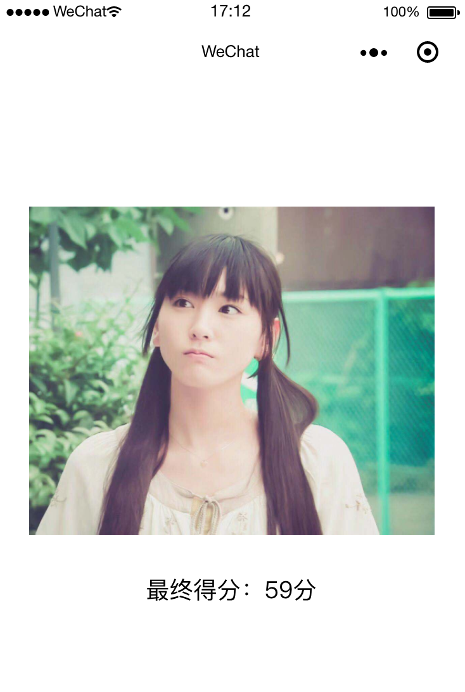

**小程序--人脸识别功能（百度ai）**
```html
文档中心：https://ai.baidu.com/docs#/Begin/a2bbf4b2
```
## 接入流程
1. 按照文档获取AppID、API Key、Secret Key，进行Access Token（用户身份验证和授权的凭证）的生成
```js
const getBaiduToken = function () {
    return new Promise((resolve, reject) => {
        //自行获取APIKey、SecretKey
        const apiKey = APIKey;
        const secKey = SecretKey;
        const tokenUrl = `https://aip.baidubce.com/oauth/2.0/token?grant_type=client_credentials&client_id=${apiKey}&client_secret=${secKey}`;
        wx.request({
            url: tokenUrl,
            method: 'POST',
            dataType: "json",
            header: {
                'content-type': 'application/json; charset=UTF-8'
            },
            success: function (res) {
                resolve(res);
            },
            fail: function (res) {
                wx.hideLoading();
                wx.showToast({
                    title: '网络错误，请重试！',
                    icon: 'none',
                    duration: 2000
                })
                reject(res);
            },
            complete: function (res) {
                resolve(res);
            }
        })
    })
}
```
2. 选择人脸识别-->人脸检测，人脸识别接口分为V2和V3两个版本，确认在百度云后台获得的是V2还是v3版本接口权限。
```js
//封装识别方法
const getImgIdentify = function(tokenUrl, data){
    return new Promise((resolve, reject) => {
        const detectUrl = `https://aip.baidubce.com/rest/2.0/face/v3/detect?access_token=${tokenUrl}`;
        wx.request({
            url: detectUrl,
            data: data,
            method: 'POST',
            dataType: "json",
            header: {
                'content-type': 'Content-Type:application/json; charset=UTF-8'
            },
            success: function (res) {
                resolve(res);
            },
            fail: function (res) {
                wx.hideLoading();
                wx.showToast({
                    title: '网络错误，请重试！',
                    icon: 'none',
                    duration: 2000
                })
                reject(res);
            },
            complete: function (res) {
                resolve(res);
            }
        })
    })
}

```
3. 调用识别方法
```js
getBaiduToken().then((res) => {
    let token = res.data.access_token;
    let data = {
        "image": self.data.img,
        "image_type":"URL",
        "face_field":"ge,beauty,expression,face_shape,gender,glasses,landmark,race,quality,eye_status,emotion,face_type"
    }
    util.getImgIdentify(token, data).then((res)=>{
        //百度接口返回的结果
        let score = parseInt(res.data.result.face_list[0].beauty);
        self.setData({
            score: score,
        })
    })
})
```

4. 结果如下：



哼～一点都不准